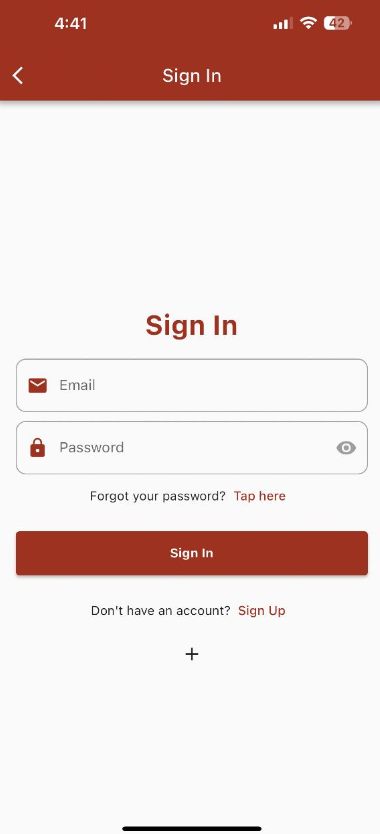
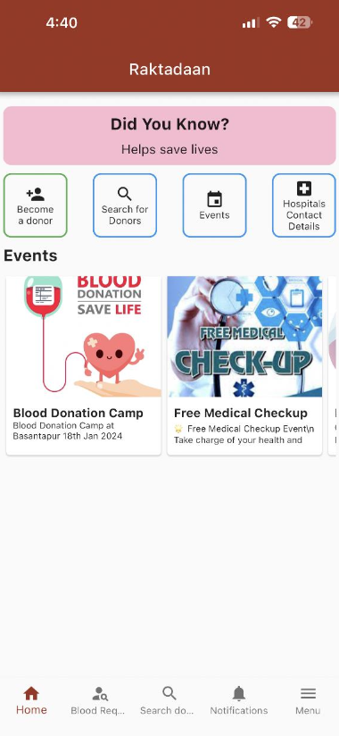
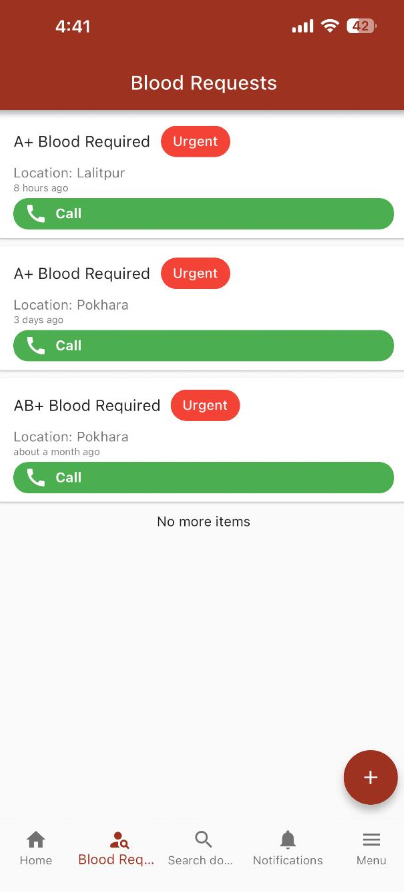
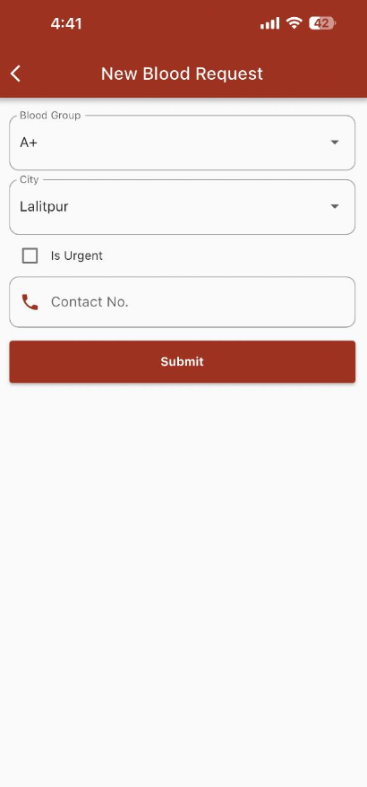
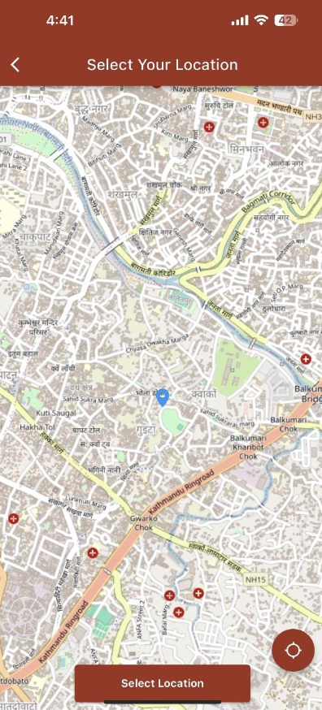
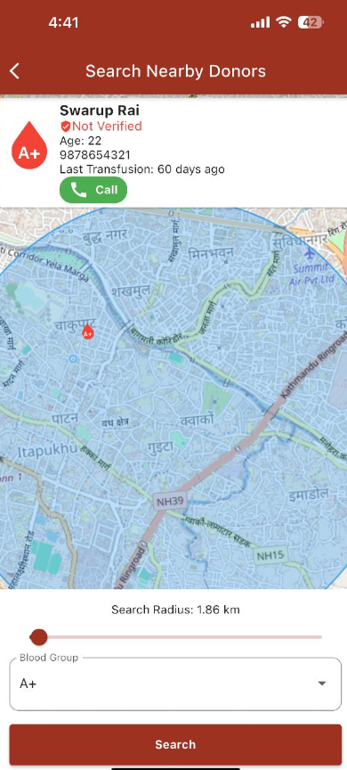
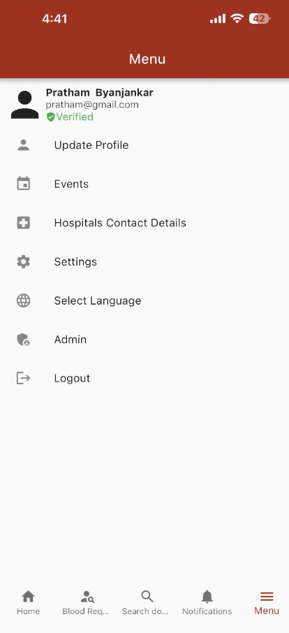
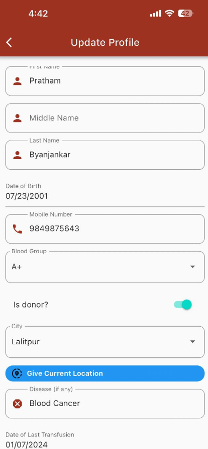

# Blood Donor Information System (Raktadaan)

**Raktadaan** is a mobile application designed to streamline the process of connecting blood donors with recipients. The app aims to reduce delays in acquiring blood during emergencies by providing a centralized platform where users can search for donors based on their blood group and location.

With features like real-time donor search, proximity tracking, and user-friendly interfaces, Raktadaan bridges the communication gap between donors and recipients, ensuring timely support and saving lives.

## Features

- **User Authentication**: Secure login and registration system for donors and recipients.
- **Donor Search**: Search for donors by blood group, location, or within a specified proximity using geohashing and the Haversine formula.
- **Proximity-Based Results**: View nearby donors on a map for quicker response times.
- **Real-Time Notifications**: Notify users of blood requests and updates instantly.
- **Admin Module**: Manage user accounts, blood requests, and donor profiles.
- **Multiplatform Compatibility**: Seamlessly works on Android and iOS devices.

## Technologies Used

- **Dart**: Programming language for building scalable and fast applications.
- **Flutter**: Frontend framework for creating intuitive and cross-platform mobile interfaces.
- **Firebase**:
  - Firestore: NoSQL database for real-time data synchronization.
  - Authentication: Secure user authentication and session management.
- **ExpressJS**: API creation and server-side logic.

## App Screenshots

|  |  |  |  |
| -------------------------- | -------------------------- | -------------------------- | -------------------------- |
|  |  |  |  |
